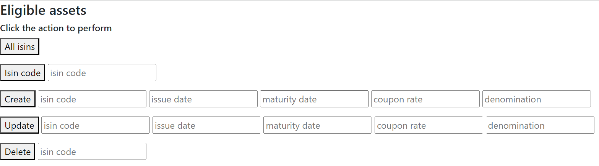

# data-representation-project
## Project for the Data Representation module 2023
## Anja Antolkovic

This repository contains the work done as a project for the Data Representation module as part of the HDip in Data Analytics, ATU. The aim of the project was to demonstrate the understanding how to create and consume RESTful APIs. 

The website provides a simple interface (Figure 1) to query, create, update and delete assets eligible for collateral mobilisations.  

Use the following formats for create/update:
- date: dd/mm/yyyy
- coupon rate: numbers, can be rounded and/or decimals
- denomination: three letter currency acronyms in capital letters e.g. EUR/USD/YEN

'All isins' retrive all assets aligible for collateral mobilisation in a list format. 

Figure 1: Home page

## How to run the project
1. Clone this repository
2. Install the libraries from requirements.txt
3. Make sure to have MySql server installed and running on you machine
4. Replace the current mySQL details present in dbconfig.py with your own ones 
5. Run create_database.py
6. Run create_table.py
7. Run insert_database.py
8. Run server.py
9. Open your browser and run http://127.0.0.1:5000/

## References
1. European Central Bank. (2023, January 2). Download eligible assets datasets. https://www.ecb.europa.eu/paym/coll/assets/html/list-MID.en.html
2. Great Learning Team. (2022, October 21). Everything you need to know about Flask for beginners. - Great Learning. Great Learning Blog: Free Resources What Matters to Shape Your Career! https://www.mygreatlearning.com/blog/everything-you-need-to-know-about-flask-for-beginners/
3. Welcome to Flask — Flask Documentation (2.3.x). (n.d.). https://flask.palletsprojects.com/en/2.3.x/
4. Python filter() Function. (n.d.). https://www.w3schools.com/python/ref_func_filter.asp
5. Python Lambda. (n.d.). https://www.w3schools.com/python/python_lambda.asp
6. Engine Configuration — SQLAlchemy 2.0 Documentation. (n.d.). https://docs.sqlalchemy.org/en/20/core/engines.html
7. Contributors, M. O. J. T. a. B. (n.d.). Bootstrap. https://getbootstrap.com/
8. Sebhastian, N. (2021). JavaScript programmatically create an HTML button. Sebhastian. https://sebhastian.com/javascript-create-button/?utm_content=cmp-true
9. Get Form Input value to jQuery AJAX call URL variable. (n.d.). Stack Overflow. https://stackoverflow.com/questions/58597048/get-form-input-value-to-jquery-ajax-call-url-variable
10. Passing data from html into mysql database using flask and Ajax. (n.d.). Stack Overflow. https://stackoverflow.com/questions/53686679/passing-data-from-html-into-mysql-database-using-flask-and-ajax